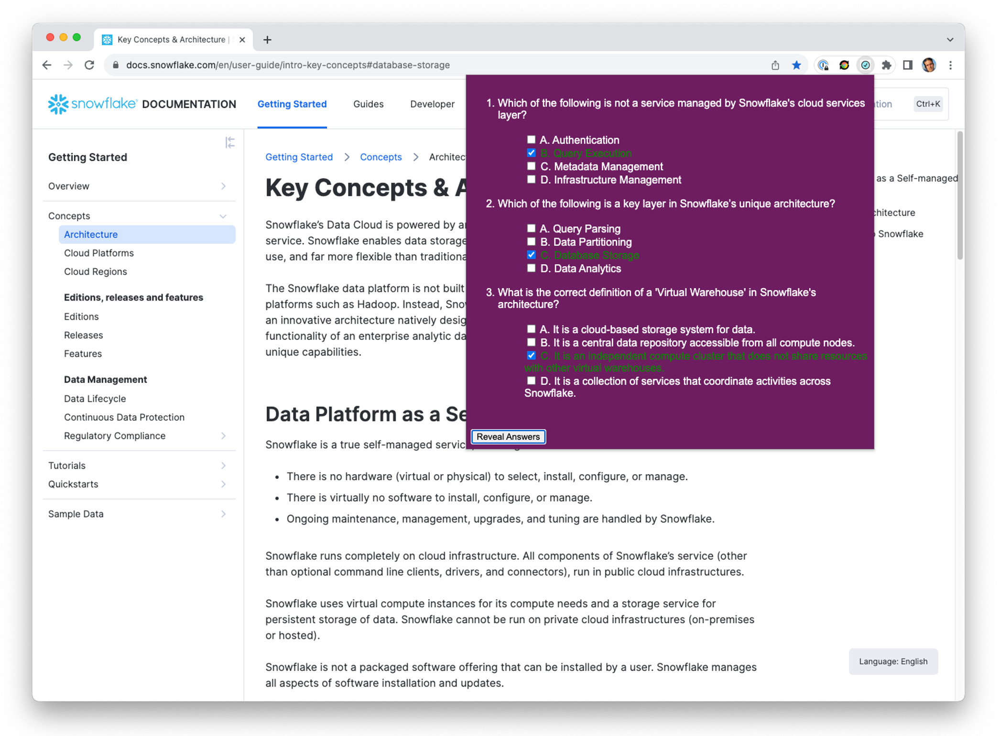

# Question Generator Chrome Browser Extension

Chrome browser extension that generates multiple-choice questions based on the content of the currently visited webpage. The OpenAI API is used as an LLM backend to generate these questions. Thus, an OpenAI API key is required. See [this](https://xebia.com/blog/soft-integration-of-llms-via-browser-extensions/) blog post for more details.

